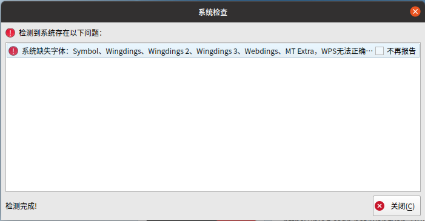

# linux安装wps字体缺失问题

## 问题

ubuntu安装WPS后打开出现字体缺失问题。



## 解决方法

### 下载缺失字体

```shell
wget 
```
### 解压字体

```shell
unzip wps_fonts.zip
```

### 移动字体

```shell
sudo cp -r ./wps_fonts /usr/share/fonts
```

### 修改字体权限

```shell
cd /usr/share/fonts
sudo chmod 755 wps_fonts
cd wps_fonts
sudo chmod 644 *
```

### 生成字体索引

```shell
sudo mkfontdir
sudo mkfontscale
```

### 更新字体缓存

```shell
sudo fc-cache 
```

重启WPS，缺失字体的问题就解决了。
